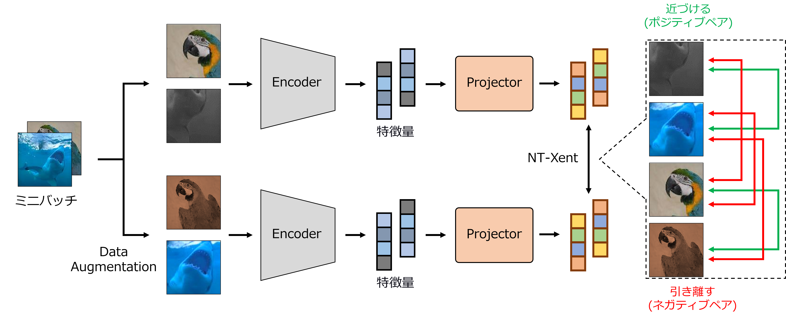

# Self-Supervised_Learning_Sample
自己教師あり計量学習のサンプルコード

## SimCLR


## SimSiam


## 動作環境
<details>
<summary>ライブラリのバージョン</summary>
 
* cuda 12.1
* python 3.6.9
* torch 1.8.1+cu111
* torchaudio  0.8.1
* torchinfo 1.5.4
* torchmetrics  0.8.2
* torchsummary  1.5.1
* torchvision 0.9.1+cu111
* timm  0.5.4
* tlt  0.1.0
* numpy  1.19.5
* Pillow  8.4.0
* scikit-image  0.17.2
* scikit-learn  0.24.2
* tqdm  4.64.0
* opencv-python  4.5.1.48
* opencv-python-headless  4.6.0.66
* scipy  1.5.4
* matplotlib  3.3.4
* mmcv  1.7.1
</details>

## ファイル＆フォルダ一覧

<details>
<summary>学習用コード等</summary>
 
|ファイル名|説明|
|----|----|
|train_ssl.py|自己教師あり学習によるResNetを事前学習するコード．|
|trainer.py|学習ループのコード．|
|ssl_loss.py|自己教師あり学習の損失のコード．|
|base_model.py|ResNetのモデルを定義したコード．|
</details>

## 実行手順

### 環境設定

[先述の環境](https://github.com/SyunkiTakase/Self-Supervised_Learning_Samle?tab=readme-ov-file#%E5%8B%95%E4%BD%9C%E7%92%B0%E5%A2%83)を整えてください．

### 学習
ハイパーパラメータは適宜調整してください．

<details>
<summary>自己教師あり学習によるResNetの事前学習(CIFAR-10)</summary>

SimCLRの学習 
```
python3 train_ssl.py --epoch 10 --img_size 32 --dataset cifar10 --method SimCLR
```
SimSiamの学習
```
python3 train_ssl.py --epoch 10 --img_size 32 --dataset cifar10  --method SimSiam
```
</details>

<details>
<summary>自己教師あり学習によるResNetの事前学習(CIFAR-100)</summary>

SimCLRの学習 
```
python3 train_ssl.py --epoch 10 --img_size 32 --dataset cifar10  --method SimCLR
```
SimSiamの学習
```
python3 train_ssl.py --epoch 10 --img_size 32 --dataset cifar100  --method SimSiam
```
</details>

## 参考文献
* 参考にした論文
  * ResNet
    * Deep Residual Learning for Image Recognition
  * SimCLR
    * A Simple Framework for Contrastive Learning of Visual Representations
  * SimSiam
    * Exploring Simple Siamese Representation Learning

* 参考にしたリポジトリ 
  * timm
    * https://github.com/huggingface/pytorch-image-models
  * ResNet
    * https://github.com/huggingface/pytorch-image-models/blob/main/timm/models/resnet.py
  * SimCLR
    * https://github.com/sthalles/SimCLR
  * SimSiam
    * https://github.com/facebookresearch/simsiam
